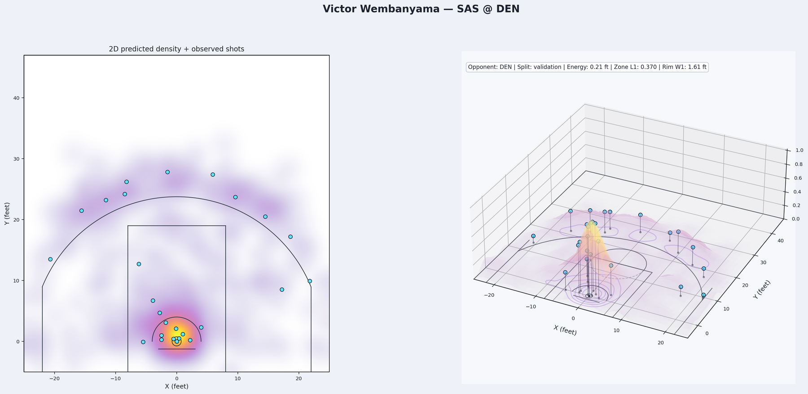
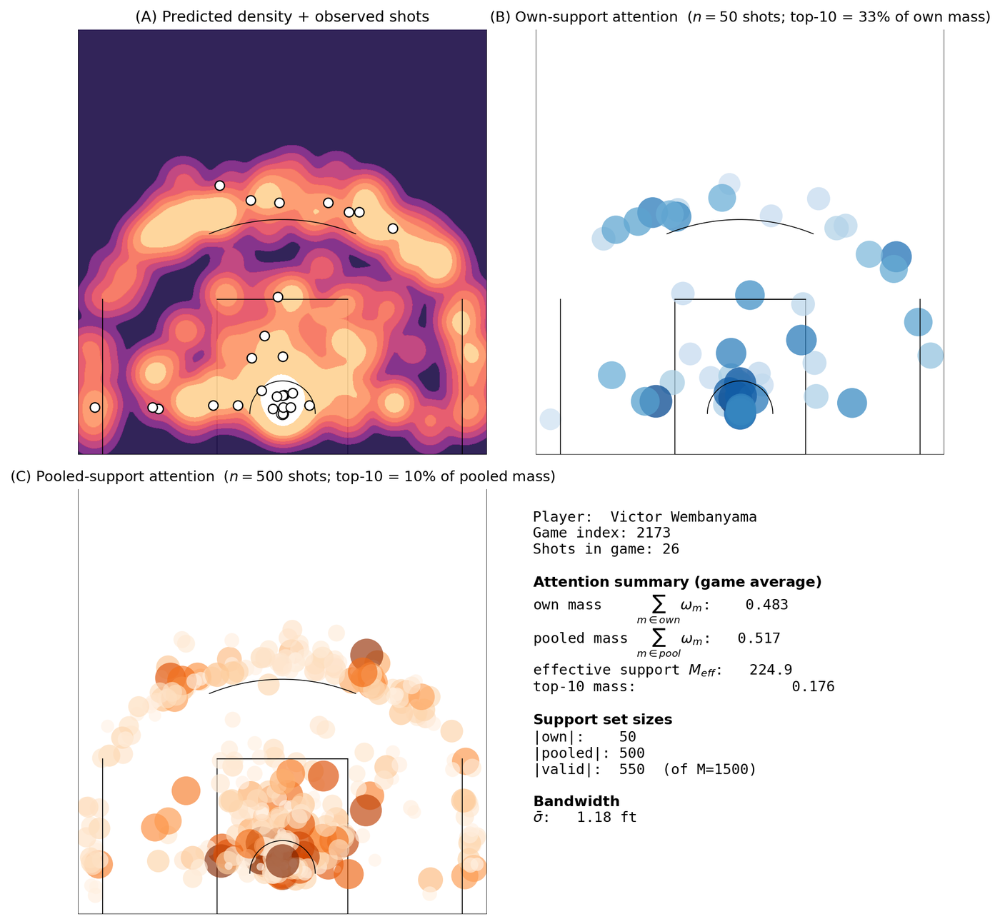
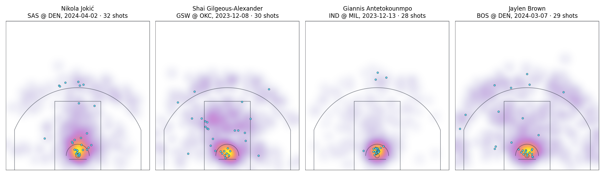

# shotcloud

**Where will a player shoot tonight?** `shotcloud` forecasts the *shot cloud* of
an NBA player-game — how many shots, when, and from where on the floor — and
scores the forecast against the shots the player then takes.



*Victor Wembanyama, San Antonio at Denver, a held-out game. Left: the predicted
density with the 29 shots he took. Right: the same density as a surface over
the half court, with each observed shot on a stem.*

This repository holds the `shotcloud` Python package: the model, its
training and evaluation scripts, and the visualization tools. The
accompanying paper is in preparation.

## The model

A player-game is a marked point process with three factors:

- **Count** — the number of shots, from a negative-binomial count head.
- **Timing** — when each shot is taken, from a 48-bin softmax over game minutes.
- **Location** — where each shot is taken, from the Adaptive Collaborative KDE
  (AC-KDE).

AC-KDE places a kernel on every *support shot* and learns how much each one
should count. The support has two parts: the player's own past shots, and
shots pooled from *analogue* players with similar traits. The weights combine
shooter similarity, shot-level attention, a low-rank contextual residual, and
opponent reweighting, and a pooling gate decides how much mass goes to the
player's own history and how much is borrowed. A rookie leans on the pool; a
veteran is described mostly by his own shots.



*What the model attends to for one game. (A) The predicted density with the
observed shots. (B) Weights on the player's own past shots. (C) Weights on
shots pooled from analogue players. About half of the mass is borrowed here,
because the player is a rookie with a short history.*

Every input is causal: it is computed only from information available before
the shot being predicted.

## Shot clouds



*Predicted densities with observed shots for four held-out player-games.*

The figures come from the package's own tools:
`scripts/plot_hero_shot_clouds.py` draws the density overlays and
`scripts/build_attention_figure.py` the attention panels. The renderer also
works on any set of shot coordinates, with no model involved:

```python
from shotcloud.viz import EnergyBodyConfig, render_energy_body

# x, y: shot coordinates in feet, basket at the origin
render_energy_body(x, y, "shot_cloud.png", config=EnergyBodyConfig())
```

`uv run python examples/energy_body_demo.py` renders a synthetic example.

## Install

Requires [uv](https://docs.astral.sh/uv/) and Python 3.11+.

```bash
uv sync --all-extras   # package (editable) plus the data, viz, train, and dev extras
uv sync                # runtime dependencies only
```

## Data

Everything comes from the public NBA Stats API through the `fetch_*` scripts
in [scripts/](scripts/) (install the `data` extra). Four tables feed the
model; a fifth, play-by-play lineups, serves only the optional presence model.

| Variable | Default | Contents | Fetched by |
| --- | --- | --- | --- |
| `GAME_LOGS` | `data/raw/player_game_logs.csv` | per-player box scores, one row per player-game | `fetch_game_logs.py`, one request per season |
| `SHOTS` | `data/raw/shot_data.csv` | every shot with court coordinates | `fetch_shots.py`, one request per player-season |
| `STARTERS` | `data/raw/starters.csv` | starter status per player-game | `fetch_starters.py`, one request per game |
| `PLAYER_BIO` | `data/player_bio.csv` | height, weight, position, birth date | `fetch_player_bio.py`, one request per player |
| `PBP_EVENTS` | `data/raw/pbp_events/` | play-by-play events with on-court lineups | `fetch_play_by_play.py`, one feed per game |
| `SNAPSHOTS` | `data/snapshots_K4.pt` | causal snapshot store | built by `pretrain_snapshots.py` |

The fetchers are resumable and rate-limited; the game logs take a minute, the
shots about an hour, the starters several hours. `replication/00_data.sh`
runs the first four in order. Set `RAW_DATA` to move the raw tables at once,
and `DEVICE` (`mps` by default) to choose `cpu`, `cuda`, or `mps`.

## Running the code

The command-line scripts live in [scripts/](scripts/). Most have a
ready-to-run launcher of the same name in [scripts/runs/](scripts/runs/):

```bash
scripts/runs/train_gibbs.sh               # train AC-KDE with the reference configuration
tail -f logs/train_gibbs_*.log            # follow its log
```

A launcher starts its job in the background under `nohup caffeinate`, so the
run survives a closed terminal and the machine stays awake until it finishes.
It prints the PID and the log file, which is written to `logs/`.

```bash
scripts/runs/train_gibbs.sh --n-epochs 5 --output-dir outputs/scratch   # override flags
SHOTCLOUD_FOREGROUND=1 scripts/runs/evaluate_shot_clouds.sh             # run in this shell
SHOTS=/data/shots.csv DEVICE=cpu scripts/runs/train_count_head.sh       # other data, other device
```

Extra arguments are forwarded to the Python script and take precedence over
the launcher's own. Each script documents its inputs, outputs, and options in
its module docstring and under `--help`:

```bash
uv run python scripts/train_gibbs.py --help
```

The pipeline, in order:

| Step | Launcher | Writes |
| --- | --- | --- |
| Fetch the raw data | `scripts/runs/fetch_game_logs.sh`, `fetch_shots.sh`, `fetch_starters.sh`, `fetch_player_bio.sh` | the tables above |
| Build the snapshot store | `scripts/runs/pretrain_snapshots.sh` | snapshot store and manifest |
| Pretrain the count head | `scripts/runs/train_count_head.sh` | count-head run directory |
| Pretrain the timing head | `scripts/runs/train_timing_head.sh` | timing-head run directory |
| Train AC-KDE | `scripts/runs/train_gibbs.sh` | `modules.pt`, `manifest.json`, `history.json` |
| Finite-cloud metrics | `scripts/runs/evaluate_shot_clouds.sh` | cloud metrics JSON |
| Density-surface metrics | `scripts/runs/evaluate_density_surfaces.sh` | density metrics JSON |
| Reference KDE baseline | `scripts/runs/evaluate_baseline_kde.sh` | cloud and density metrics JSON |
| MDN baseline | `scripts/runs/train_mdn.sh`, `scripts/runs/evaluate_mdn.sh` | MDN run directory and metrics |
| Sample shot clouds | `scripts/runs/sample_shot_clouds.sh` | sampled clouds |
| Figures | `scripts/runs/build_attention_figure.sh`, `scripts/runs/plot_hero_shot_clouds.sh` | PNG figures |

These launchers write to fresh output paths, so they do not overwrite
existing results. The remaining launchers in `scripts/runs/` cover
diagnostics and audits.

## Reproducing the results

[replication/](replication/) is a numbered pipeline from raw data to the
reported metrics and figures:

```bash
replication/run_all.sh                    # everything, in order
SKIP_ABLATIONS=1 replication/run_all.sh   # without the comparison training runs
DRY_RUN=1 replication/run_all.sh          # print what would run; execute nothing
```

Stages write to fixed output paths and skip any step whose outputs already
exist, so a rerun resumes where it stopped. See
[replication/README.md](replication/README.md) for the stages, the table that
maps each reported table and figure to its source file, and the items the
pipeline does not cover.

The scripts `scripts/run_experiment_*.sh` and `scripts/eval_*.sh` hold the
exact configuration of each reported run; the replication stages call them.

## Repository layout

```
src/shotcloud/
  data/          loaders, context encoder, causal snapshot store, player features
  grids/         court grid and coordinate conversions
  kde/           kernel density engines
  features/      opponent, matchup, and usage features
  models/        AC-KDE spatial factor, count and timing heads, baselines
  training/      datasets, losses, and the joint trainer
  evaluation/    finite-cloud and density-surface metrics, calibration
  simulation/    shot-cloud sampling
  baselines/     causal reference KDE
  viz/           shot-cloud figures
  legacy/, legacy_pivot/   deprecated components, kept for reproducibility
scripts/         command-line entry points and experiment launchers
scripts/runs/    one launcher per script
replication/     end-to-end pipeline for the reported results
tests/           test suite
examples/        standalone rendering example
assets/          images used in this README
```

## Development

```bash
uv run pytest
uv run ruff check src tests examples scripts
uv run ruff format --check src tests examples scripts
uv run mypy src
```

## Coordinate convention

Raw NBA `LOC_X` / `LOC_Y` are tenths of feet; the loader divides by 10.

- Basket at the origin `(0, 0)`; units are feet.
- `x` positive toward the right side of the court.
- `y` positive away from the basket, toward midcourt.
- Default court extent: `x ∈ [-25, 25]`, `y ∈ [-5, 47]`.

## License

MIT — see [LICENSE](LICENSE).
